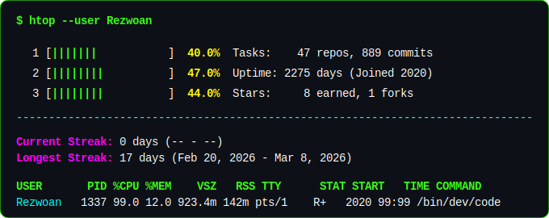

<div align="center">
  
</div>

<!-- ===== NEOFETCH TERMINAL ===== -->
<br/>

```console
$ neofetch --profile username

       /////////////////        root@rezwoan:~$
     /////////////////////      ---------------
   ///                 ///      OS:      CS Student @ AIUB
  ///   ///       ///   ///     KERNEL:  Problem Solver
 ///    ///       ///    ///    SHELL:   Full-Stack Web & Backend
 ///                     ///    UPTIME:  Learning since 2021
 ///   ///           /// ///    DE:      Dhaka, Bangladesh
  ///   /////////////// ///     EDITOR:  VS Code
   ///                 ///      PORT:    rezwoan.me
     /////////////////////      LINK:    github.com/Rezwoan
       /////////////////
```

<br/>

<!-- ===== DYNAMIC FEEDS (TERMINAL STYLE) ===== -->
## 💻 `user@rezwoan:~$ cat currently_working_on.md`

> 🚀 _Live sync: Repos updated in the last 30 days_

<!--START_SECTION:active-repos-->
_🕐 Last updated: Apr 13, 2026_

| | |
|---|---|
| **🌐 [MAD-mid-LabTask](https://github.com/Rezwoan/MAD-mid-LabTask)**<br/>_No description_<br/>`Kotlin` ⭐ 0 🍴 0 | **🌐 [liftlog](https://github.com/Rezwoan/liftlog)**<br/>_No description_<br/>`Misc` ⭐ 0 🍴 0 |
| **🌐 [rezwoan-portfolio](https://github.com/Rezwoan/rezwoan-portfolio)**<br/>Portfolio website<br/>`TypeScript` ⭐ 0 🍴 0 | **🌐 [Rezwoan.github.io](https://github.com/Rezwoan/Rezwoan.github.io)**<br/>_No description_<br/>`JavaScript` ⭐ 0 🍴 0 |
| **🌐 [FitTrack](https://github.com/Rezwoan/FitTrack)**<br/>track gym workouts, build routines, and keep a log of your p<br/>`Python` ⭐ 0 🍴 0 | **🌐 [AlgoRace](https://github.com/Rezwoan/AlgoRace)**<br/>AlgoRace - Maze Race with Pathfinding Visualization. Built w<br/>`Python` ⭐ 1 🍴 0 |

<!--END_SECTION:active-repos-->

<br/>

## 📡 `user@rezwoan:~$ tail -f recent_activity.log`

> ⏱️ _Live tracking: Latest commits & PRs on GitHub_

<!--START_SECTION:activity-->
1. 🔒 Closed issue [#1](https://github.com/Rezwoan/MAD-mid-LabTask/issues/1) in [Rezwoan/MAD-mid-LabTask](https://github.com/Rezwoan/MAD-mid-LabTask)
2. ❗ Opened issue [#10](https://github.com/Rezwoan/MAD-mid-LabTask/issues/10) in [Rezwoan/MAD-mid-LabTask](https://github.com/Rezwoan/MAD-mid-LabTask)
3. ℹ️ Assigned issue [#10](https://github.com/Rezwoan/MAD-mid-LabTask/issues/10) in [Rezwoan/MAD-mid-LabTask](https://github.com/Rezwoan/MAD-mid-LabTask)
4. ℹ️ Assigned issue [#9](https://github.com/Rezwoan/MAD-mid-LabTask/issues/9) in [Rezwoan/MAD-mid-LabTask](https://github.com/Rezwoan/MAD-mid-LabTask)
<!--END_SECTION:activity-->

<br/>

<!-- ===== HIGH CONTRAST TECH STACK ===== -->
## ⚙️ `user@rezwoan:~$ sudo apt install stack`

<div align="center">
  <a href="https://skillicons.dev">
    
  </a>
</div>

<br/>

<!-- ===== 3D ISOMETRIC CITY ===== -->
## 🏙️ `user@rezwoan:~$ ./render_3d_contributions.sh`

<div align="center">
  <picture>
    
  </picture>
</div>
<p align="center"><em>Generated automatically via GitHub Actions</em></p>

<br/>

<div align="center">

<!--START_SECTION:htop-stats-->
<picture>
  
</picture>
<!--END_SECTION:htop-stats-->

</div>

<br/>

<!-- ===== SNAKE ANIMATION ===== -->
## 🐍 `user@rezwoan:~$ ./play_snake.py`

<div align="center">
  
</div>

<br/>

<!-- ===== CONNECT ===== -->
## 🌐 `user@rezwoan:~$ ssh connect@socials`

<div align="center">
  <a href="https://www.linkedin.com/in/din-muhammad-rezwoan-b4b87020a" target="_blank">
    
  </a>&nbsp;
  <a href="https://twitter.com/XRezwoan" target="_blank">
    
  </a>&nbsp;
  <a href="https://www.facebook.com/ager.id.hack.hoye.gase" target="_blank">
    
  </a>&nbsp;
  <a href="https://www.instagram.com/din.muhammad.rezwoan" target="_blank">
    
  </a>&nbsp;
  <a href="https://wa.me/8801643751861" target="_blank">
    
  </a>
  &nbsp;
  <a href="http://rezwoan.me" target="_blank">
    
  </a>
</div>

<br/>

<!-- ===== FOOTER ===== -->
<div align="center">

```console
$ logout
Connection to rezwoan closed.
```

</div>

